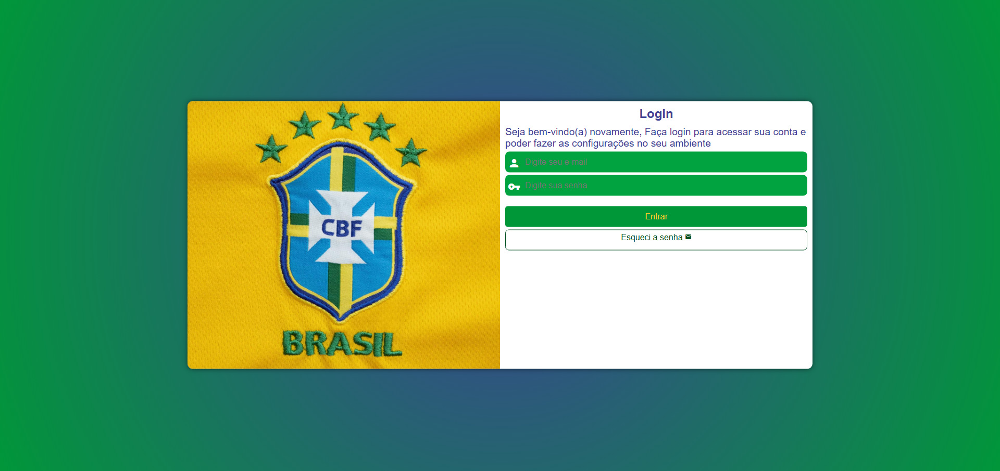

# 🔐 Projeto Login - Curso em Vídeo

Este projeto foi desenvolvido como parte do curso de **HTML5 e CSS3** do professor **Gustavo Guanabara**, disponível no [Curso em Vídeo](https://www.cursoemvideo.com).

O desafio consiste em criar uma **tela de login responsiva**, utilizando recursos modernos de HTML e CSS, com foco em design simples e usabilidade.

---

## 🎯 Objetivos do Projeto

- Criar um formulário de login com campos de **usuário** e **senha**  
- Estilizar utilizando **CSS externo**  
- Aplicar **responsividade** com media queries  
- Trabalhar com **flexbox** para layout centralizado  
- Aprimorar o uso de ícones e placeholders  

---

## 🧰 Tecnologias Utilizadas

- HTML5  
- CSS3  

---

## 📁 Estrutura do Projeto

```
projeto-login/
├── index.html
├── style.css
├── imagens/
│   ├── tela-login.jpg
│   └── icones/
│       ├── usuario.png
│       └── senha.png
```

---

## 💻 Funcionalidades

- Tela de login com campos para e-mail e senha  
- Layout responsivo: adapta-se a celulares e desktops  
- Estética moderna com cantos arredondados e sombras  
- Ícones ilustrativos dentro dos campos  

---

## 📸 Prévia do projeto




---

## 🔗 Link do projeto para Visualização


[🔗 Ver Projeto Online](https://stapani7.github.io/projeto-login)

---

## 📚 Créditos

Projeto desenvolvido como parte do curso **HTML5 e CSS3** do **Gustavo Guanabara** – [Curso em Vídeo](https://www.cursoemvideo.com).

---
